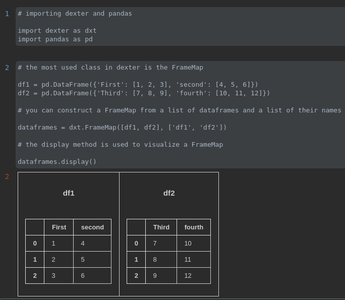
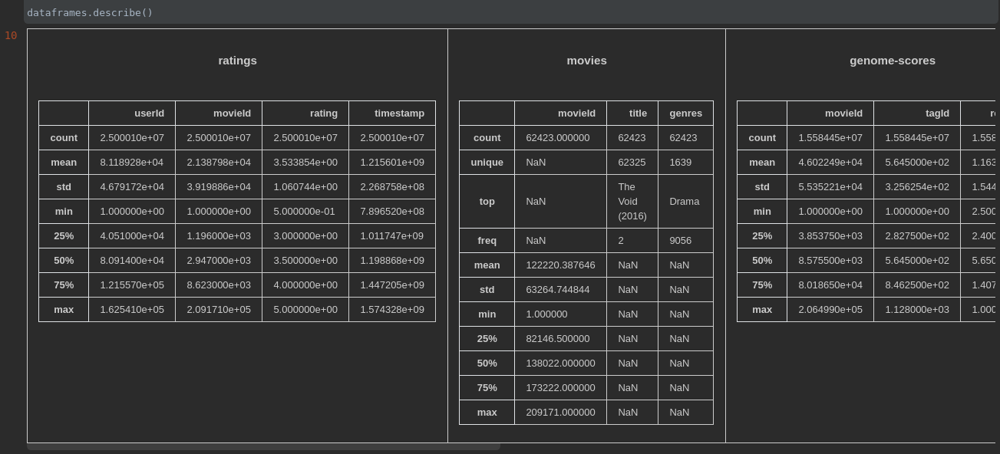
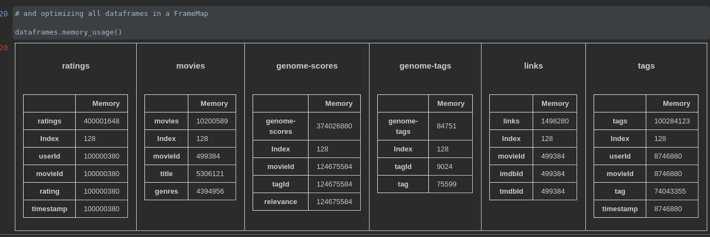

# dexter
[](https://badge.fury.io/py/dexter)
[](https://github.com/igormagalhaesr/dexter/blob/main/LICENSE.txt)
[](https://dexter.readthedocs.io/en/latest/?badge=latest)
___
>data exploration terser


## What is dexter?

**dexter** is a lightweight Python package built on top of **numpy** and **pandas** that allows fast data exploration 
for multiple structured table files in a folder. It's a high-level tool suitable for a first contact with a dataset
composed of multiple dataframes.


## Features

  - Importing multiple table files with **readm_csv()**
  - Saving DataFrames and Names with the **FrameMap** class
  - Applying pandas methods to multiple DataFrames at once

## Installing

PyPI:
```sh
pip install dexter
```

https://pypi.org/project/dexter/

## Usage 

Importing dexter:
```python
import dexter as dxt
```

Reading multiple dataframes in a folder:
```python
dataframes = dxt.readm_csv(./folder/)
```

Displaying results:
```python
dataframes.display()
```
```Out:```

<div style="float: left;margin-right:10px">
  <h5 style="text-align:center">df1</h5>
  <table>
    <tr>
      <td><b>col1</b></td>
      <td><b>col2</b></td>
      <td><b>col3</b></td>
    </tr>
    <tr>
      <td>0</td>
      <td>value1</td>
      <td>$3</td>
    </tr>
    <tr>
      <td>1</td>
      <td>value2</td>
      <td>$5</td>
    </tr>
    <tr>
      <td>2</td>
      <td>value3</td>
      <td>$7</td>
    </tr>
  </table>
</div>
<div style="float: left">
  <h5 style="text-align:center">df2</h5>
  <table>
    <tr>
      <td><b>first</b></td>
      <td><b>second</b></td>
      <td><b>third</b></td>
    </tr>
    <tr>
      <td>0</td>
      <td>one</td>
      <td>17%</td>
    </tr>
    <tr>
      <td>1</td>
      <td>two</td>
      <td>19%</td>
    </tr>
    <tr>
      <td>2</td>
      <td>three</td>
      <td>23%</td>
    </tr>
  </table>
</div>
<br />

Names and Frames
```python
names = dataframes.names
frames = dataframes.frames
```

Multiple Dataframes Types
```python
dataframes.dtypes()
```

Multiple Missing Values
```python
dataframes.multiple_missing()
```

Multiple Descriptions
```python
dataframes.describe()
```





For more concrete examples, check the [notebook](Example.ipynb)

## Contributing

1. Fork it (https://github.com/igormagalhaesr/dexter)
2. Create your feature branch (`git checkout -b feature/fooBar`)
3. Commit your changes (`git commit -am 'Add some fooBar'`)
4. Push to the branch (`git push origin feature/fooBar`)
5. Create a new Pull Request

## Dependencies

- [NumPy](https://www.numpy.org)
- [Pandas](https://pandas.pydata.org/)
- [IPython](https://ipython.org/)

## License

Distributed under the [BSD 3](LICENSE.txt) license. See ``LICENSE.txt`` for more information. 

## Contact

Igor Magalhaes – [@igormagalhaesr](https://twitter.com/igormagalhaesr) – igormagalhaesr@gmail.com

[github.com/igormagalhaesr](https://github.com/igormagalhaesr/)
